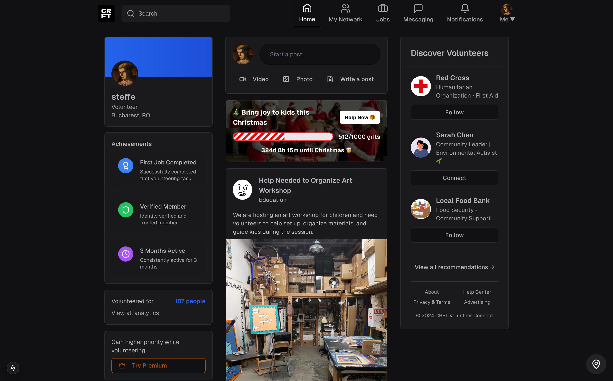
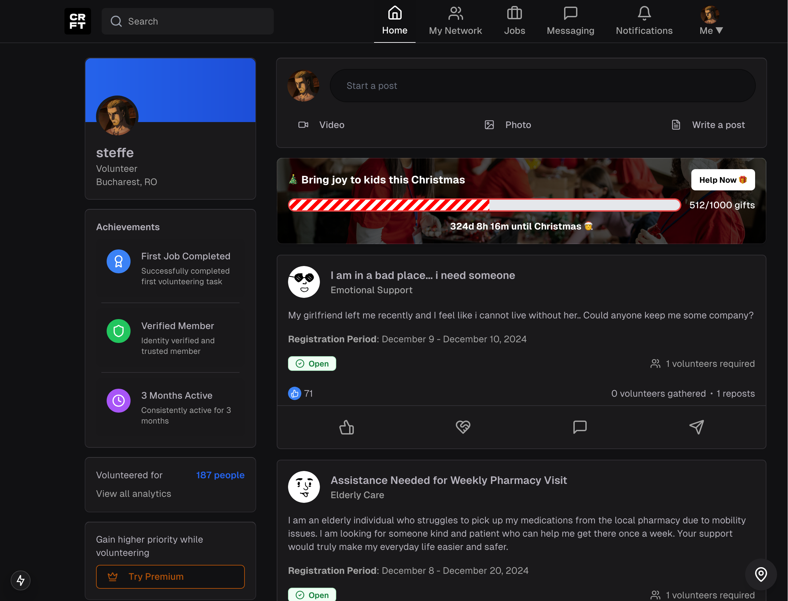
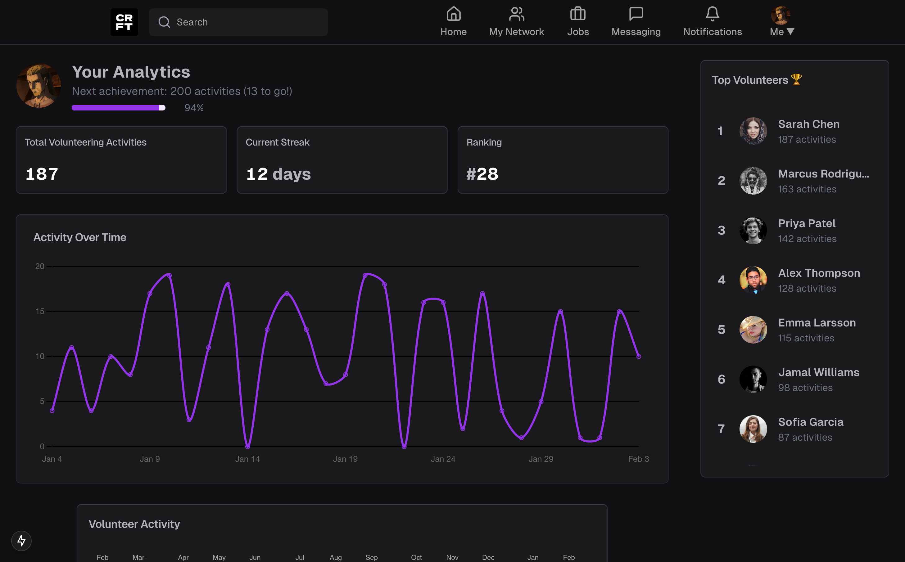

# HackITAll 2024 CRFT Project

## Competition Theme: Connecting Communities
**Technology for Bringing People Together**

### Challenge:
Develop an innovative web and/or mobile application that brings people together, promoting collaboration, inclusion, or community support.

### Example Ideas (but not limited to):
- An interactive platform for language learning and cultural exchange.
- A platform that connects refugees or disadvantaged individuals with resources and support.
- An application that gamifies volunteer activities for environmental or community support.

### Judging Criteria:
- **Originality and Innovation**: The idea is creative and distinctive.
- **Prototype Quality**: Functionality and technological feasibility.
- **Design and User Experience**: The application is intuitive and visually appealing.
- **Social Impact and Scalability**: The solution provides value to communities and has growth potential.
- **Final Presentation and Communication**: The presentation is clear, well-organized, and engaging.

## Screenshots

  
*Landing page*

  
*Responsive for tablets and mobile*

  
*Analytics page*

# Achievement

### 🏆 Our project secured 2nd place in the HackITAll 2024 hackathon!
